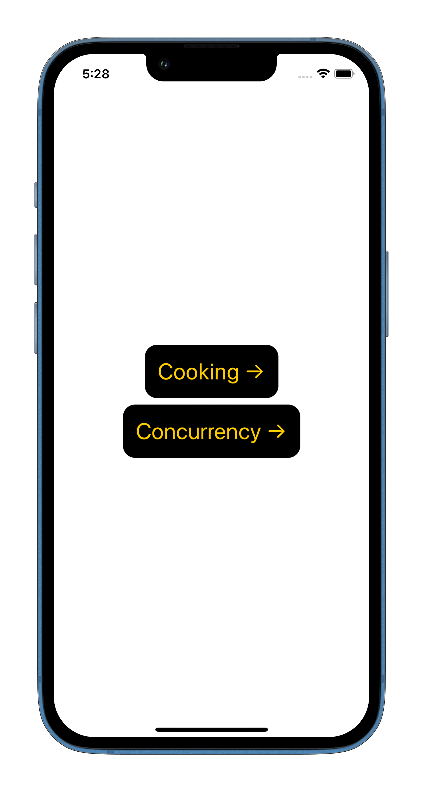
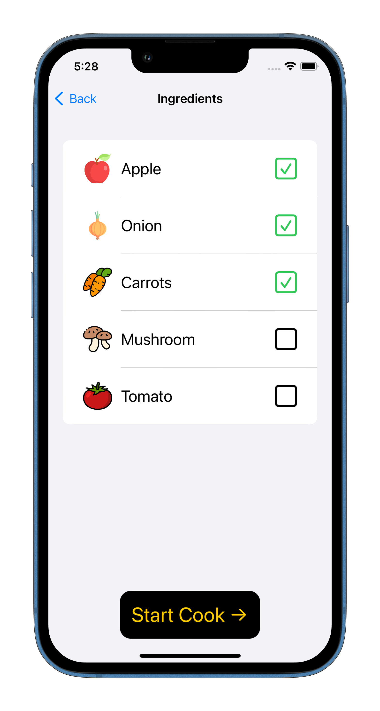
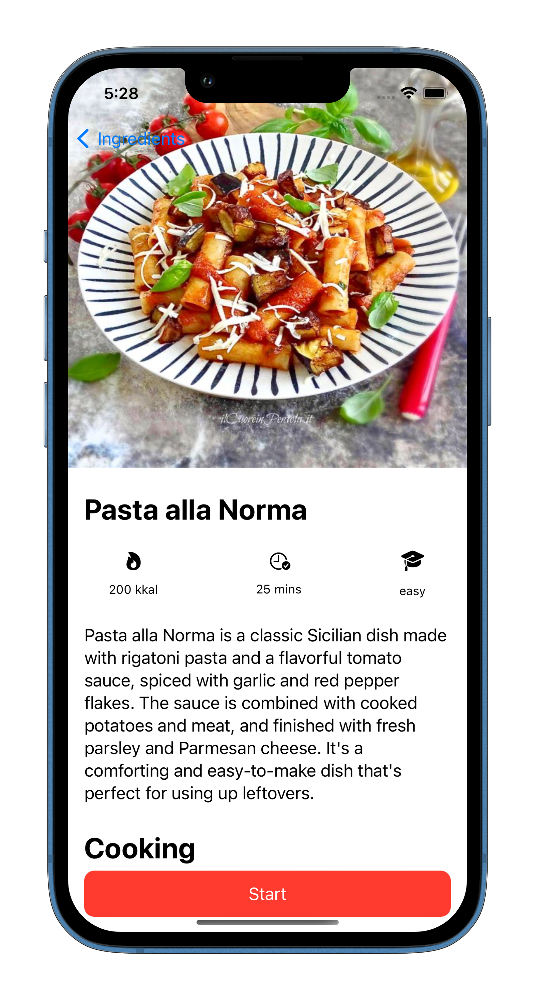
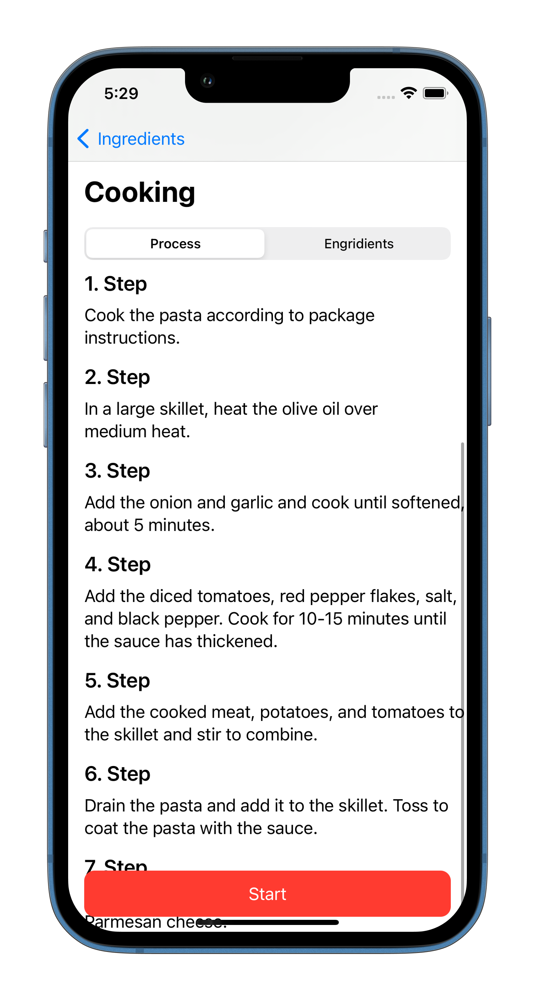
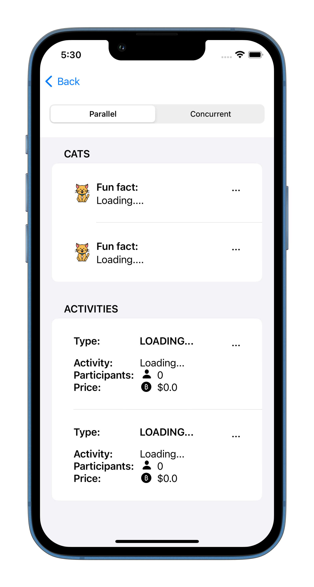

# CookMart is the best

## Concurrency and Composable Architecture Experiments

This repository contains two separate experiments that demonstrate different concepts related to iOS development. The first experiment is a demonstration of concurrency, while the second experiment is focused on implementing an app using a composable architecture style.

    
    
    
    
    
    

###  Experiments
1. [Concurency in SwiftUI.](#concurency) 
Explore our iOS concurrency experiment that showcases the benefits of concurrency with a simple view that sends four sequential requests to a server. Here.
2. [Composable Architecture.](#composable_architecture)
 Check out our iOS app experiment that implements the Point-Free Composable Architecture (PCA) library. Three screens built using PCA provide a clear separation of concerns between business logic and user interface

## Concurency in SwiftUI
This iOS app is designed to demonstrate the concept of concurrency and how it can be used to optimize the performance of an app. The app features a simple view that sends four requests sequentially to a server.
#### Process
When the user initiates the requests, the app sends the first request and waits for a response before sending the second request. This process continues until all four requests have been sent and received.

By implementing this process sequentially, we can observe how long it takes for each request to be completed and how the performance of the app is affected by the delay between each request. We can also compare this approach to sending all four requests at once and observe the differences in performance.
#### Implementation
The app is built with the latest iOS technologies and is designed to be easy to use and understand. The code is well-organized and documented, making it easy for other developers to modify and build upon the app's functionality.
#### Conclusion
This experiment provides a practical example of how concurrency can be used to improve the performance of an app. By allowing multiple requests to be processed simultaneously, the overall processing time can be reduced, resulting in a more efficient and responsive app. We hope that this app will be useful to other developers who are interested in learning more about concurrency and its benefits.

## Composable Architecture
The app is built using the Point-Free Composable Architecture (PCA) library, which is a Swift package that provides a functional and composable architecture for building iOS apps.

The app is divided into three screens: the ingredients list screen, the meal details screen, and the cooking instructions screen. Each screen is built using the PCA architecture, which provides a clear separation of concerns between the app's business logic and its user interface.

The ingredients list screen allows the user to select the ingredients they want to use for their meal. Once the user has selected their ingredients, they can tap the "Start cooking ->" button to navigate to the meal details screen.

The meal details screen displays a large cover image of the selected meal, as well as a brief description of the meal. Additionally, the screen displays the cooking instructions for the meal, which are presented step-by-step.

#### Conclusion
By using the PCA architecture, the app is easy to understand and modify. The business logic and user interface are clearly separated, which makes it easy to test and refactor the app's code. Additionally, the PCA architecture provides a solid foundation for adding new features and functionality to the app in the future.
